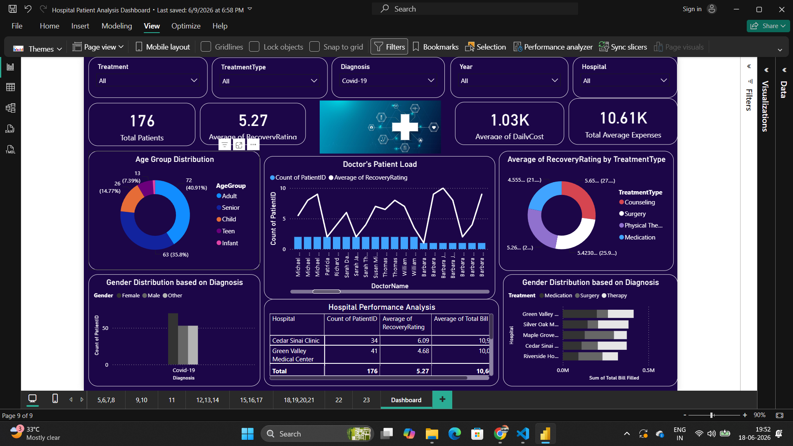

# 🏥 Hospital Patient Analysis Dashboard using Power BI

## 📌 Project Overview

This project presents an interactive Hospital Patient Analysis Dashboard developed using Power BI. It analyzes patient records to provide meaningful insights into hospital operations, treatment performance, patient recovery, and healthcare costs. The dashboard enables users to explore hospital data using interactive filters and visualizations for better decision-making.

---

## 📷 Dashboard Preview



---

## 🎯 Project Objectives

- Analyze patient demographics.
- Monitor treatment performance.
- Evaluate patient recovery ratings.
- Compare hospital performance.
- Analyze treatment costs.
- Create an interactive dashboard using Power BI.

---

## 🛠️ Tools & Technologies

- Power BI
- Power Query
- DAX
- CSV Dataset
- Data Visualization

---

## 📂 Repository Structure

```
Dataset/
PowerBI/
Screenshots/
Documentation/
README.md
```

---

## 📊 Dashboard Features

- Interactive Slicers
- KPI Cards
- Donut Charts
- Line Chart
- Clustered Bar Chart
- Matrix Table
- Dynamic Filtering
- Cross Highlighting

---

## 📈 Key Performance Indicators (KPIs)

- Total Patients
- Average Recovery Rating
- Average Daily Cost
- Total Average Expenses

---

## 📊 Visualizations Used

- Age Group Distribution
- Doctor's Patient Load
- Recovery Rating by Treatment Type
- Gender Distribution based on Diagnosis
- Hospital Performance Analysis
- Hospital-wise Treatment Cost Analysis

---

## 💡 Business Insights

- Identify hospitals with better recovery ratings.
- Analyze patient distribution across age groups.
- Compare treatment effectiveness.
- Monitor average treatment expenses.
- Evaluate doctor workload and hospital performance.

---

## 🚀 Future Improvements

- Real-time hospital data integration
- Predictive analytics using Machine Learning
- Patient readmission analysis
- Doctor performance dashboard
- Mobile-friendly Power BI report

---

⭐ If you found this project helpful, consider giving it a star!
